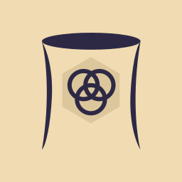

  

<h1 align="center">
  Nova Reactor Webstie
</h1>

Open-Source for showcase only, check out my other projects!

# Home Structure

---

Home | Devlogs | Games | Contact

## Intro
We're a group of passionate game developers, we are currently publishing on itch.io with plans to move to steam when the time is right and when the community grows! On this site you'll find the devlogs, if you like recorded format more, check out our YouTube channel.

#### Recent Devlogs

#### Game carousel

## Contact
We're open for collaboration, if you'd like to join us at a game jam or talk about some of our projects then go to contact page!

by Marcin Smoła 2022